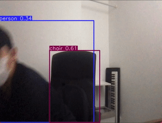
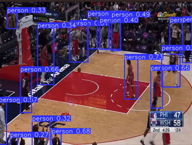

# Real time Object Detection

This repository makes use of the Object Detection Archietecture, [YOLOV5](https://github.com/ultralytics/yolov5), to do real time object detection on webcam stream, youtube videos, and normal videos. I made use of [OpenCV2](https://opencv.org/) to run object detection on each pixel from the video.


## Installation
```
pip install -r requirements.txt
```

## Getting Started
Directly from the webcam
```
python3 app.py
```

From Youtube Link
```
python3 app.py --youtube_link <YOUTUBE_LINK>
```
e.g.
```
python3 app.py --youtube_link https://www.youtube.com/watch?v=BZP1rYjoBgI&ab_channel=UndoTube 
```

From Local video
```
python3 app.py --video_path <PATH_TO_VIDEO>
```
## Demo
### Using Web Cam


### YouTube Video



